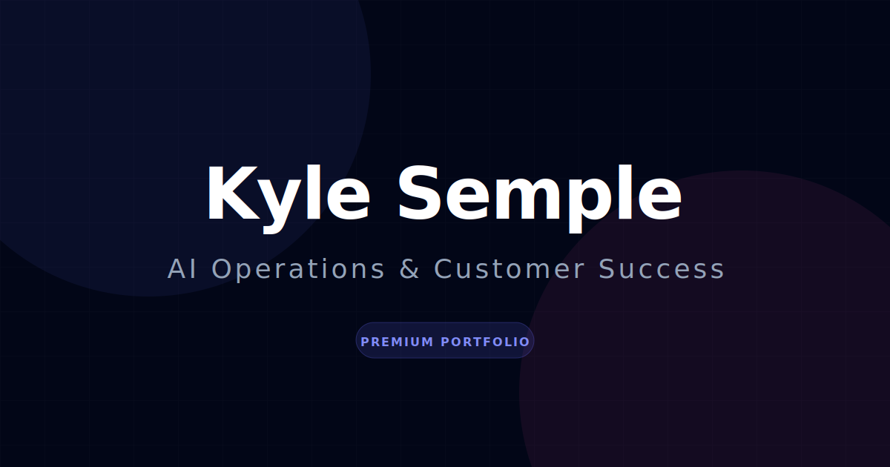

<div align="center">
  

# Kyle Semple — Professional Portfolio

**Forward Deployed Engineer · Technical Systems Translator** · Washtenaw County, MI

[Live Site](https://kyle-semple-portfolio-786228485832.us-central1.run.app) · [How It Was Built](HOW_IT_WAS_BUILT.md) · [Architecture Decisions](DECISIONS.md) · [Architecture Overview](ARCHITECTURE.md)

[](https://github.com/slyberia/Portfolio2.0/actions/workflows/ci.yml)


</div>

---

## Current Portfolio Architecture

Portfolio2.0 leads with a single professional thesis rather than a menu of role tracks:

> Kyle Semple is a **Forward Deployed Engineer · Technical Systems Translator** who helps teams
> turn complex technical, operational, and spatial problems into systems people can understand,
> adopt, and use.

Forward Deployed Engineer is the searchable role anchor; Technical Systems Translator is the capability descriptor that explains the value at first read. The homepage opens with that identity and a "What I Help Teams Do" proof-pillar section. Role tracks are demoted to supporting **role lenses** (Forward Deployed Engineer, Implementation Consultant, Spatial Systems Architect, AI Workflow / Portfolio Governance) — surfaced as lower-priority metadata and a secondary navigation dropdown, never the primary framing. Project cards and case studies carry a stakeholder/customer-value layer (purpose · value · role relevance · proof type), deep dives reinforce the translation/adoption thesis, and the Digital Twin assistant explains Kyle via the same thesis and routes visitors by need. Machine-readable crawler/LLM summaries are aligned to the hybrid Forward Deployed Engineer · Technical Systems Translator positioning.

Customer Success is presented as an **evidence layer**, not a seniority claim — no managed book of business, ARR/NRR, or renewal/expansion ownership is asserted anywhere.

## Engineering Evidence

This site is part of the portfolio itself. Beyond the finished product, the thinking behind it is
written down in plain sight: how it was built, the choices that were made and why, and where AI
helped versus where a person made the call. If you read nothing else here, read these.

### 🏗 How It Was Built — [`HOW_IT_WAS_BUILT.md`](HOW_IT_WAS_BUILT.md)

The honest story of building the site with AI. The first version was created in Google AI Studio
(Google's Gemini AI) by steering the AI with clear instructions and pushing back when its
suggestions weren't good enough — not by accepting whatever it produced. When that early version was
turned into a real, live website, **four problems showed up, and the document explains how each was
fixed in everyday terms**:

- **The quality checks weren't turned on.** The early setup let mistakes slip through; stricter
  automatic checking was switched on and the code cleaned up to pass it.
- **It wasn't packaged to run on its own.** The prototype borrowed its building blocks from the
  internet at page load; it was rebuilt to bundle everything properly so it runs reliably.
- **A secret password was visible to visitors.** The key that talks to the AI service was exposed in
  the page's code; it was moved to a private server so visitors can never see it.
- **Untrusted content could run harmful code.** Page content wasn't being cleaned before display; a
  filter was added to strip anything dangerous first.

It ends with a frank breakdown of what the AI made versus what the human directed, plus the story of
scrapping the original homepage design after honestly judging it against the project's own standards
and finding it fell short. The real point: using AI well — knowing when to push back, what to
double-check, and what to fix — is itself the skill on display.

### 🧭 Architecture Decisions — [`DECISIONS.md`](DECISIONS.md)

Six write-ups of the big technical choices, each showing the situation, the decision, **the
alternatives that were considered and rejected**, and the trade-offs accepted. In plain terms:

1. **Keep the AI's secret key on a private server** instead of in the public webpage.
2. **Use real, shareable web addresses** for each page instead of fragile prototype-style links.
3. **Store the project write-ups as simple text files** instead of paying for a content-management service.
4. **Clean all content before showing it** rather than removing the rich previews entirely.
5. **Keep "Recruiter Mode" to a single visit** instead of saving it in the address or the browser.
6. **Pick a testing tool that fits the build** instead of the popular default that needs extra wiring.

The value isn't the choices themselves — it's the reasoning that shows _why this and not the obvious
alternative_.

### 🗺 Architecture Overview — [`ARCHITECTURE.md`](ARCHITECTURE.md)

A simple map of how the site is put together: what technologies it uses, how the files are
organized, how a visitor's chat message travels to the AI and back (and how overuse is throttled),
how the written content is loaded, and a short security summary. Start here for a quick picture of
how the pieces fit.

### 🔍 AI Attribution — [`AI_ATTRIBUTION.md`](AI_ATTRIBUTION.md)

An honest record of exactly where AI was used. Each piece of work is graded by how much the AI did
versus the person, it clearly separates which AI tool did what (Google's Gemini vs. Anthropic's
Claude), and — unusually — it **openly flags the work that can't be traced** rather than hiding the
gaps. This is the same honesty-about-sources standard the portfolio asks of its project write-ups,
applied to the portfolio itself.

## Security Posture

The full security review and its resolution trail live in
[`SECURITY_AUDIT.md`](SECURITY_AUDIT.md) (ship-safe engagement), with policy in
[`SECURITY.md`](SECURITY.md) and threat modeling in [`THREAT_MODEL.md`](THREAT_MODEL.md).

**Every security issue affecting the live site has been fixed.** In plain terms:

- The secret key for the AI service stays on a private server and never reaches visitors; an automatic check blocks any release that would expose it.
- The chat feature limits how often it can be used, checks what's sent to it, and blocks attempts to trick the AI.
- Standard browser protections are switched on — an independent scanner (securityheaders.com) gives the live site an **A grade**.
- All page content is cleaned before it's shown, and the server runs with limited privileges so a break-in can't do as much damage.
- **No known vulnerabilities anywhere — live site or developer tools.** The software the live site depends on has been clean for a while. The only items that used to be open were a few advisories in behind-the-scenes build-and-test tools that never reach visitors; as of June 2026 those were closed too, by updating those tools to their latest versions. The result is a clean bill of health across the board.
- One known limit: the chat's usage cap is kept in memory and resets if the server restarts — acceptable for a personal portfolio.

### 🛡 What Could Go Wrong — [`THREAT_MODEL.md`](THREAT_MODEL.md)

Good security work names the threats out loud instead of assuming nothing will go wrong. This
document lists the ways the site could realistically be attacked or misused — someone hammering the
chat to run up the AI bill, trying to trick the AI into ignoring its instructions, attempting to
steal the secret key, or sneaking harmful code onto a page — and for each one it states how likely
it is, how bad it would be, and what's already in place to stop it. Just as importantly, it's honest
about the limits: it spells out the gaps that are **knowingly accepted** for a personal portfolio
(for example, the usage cap resetting on restart) and the extra protections that are **deliberately
left for later** rather than pretending the job is ever fully finished. It's a map of the risks and
the reasoning behind each call — the kind of thinking you'd want from someone building systems other
people rely on.

## Stack

| Layer    | Technology                                       |
| -------- | ------------------------------------------------ |
| Frontend | React 18, TypeScript strict, Vite 5, Tailwind v3 |
| Routing  | React Router v7                                  |
| AI       | Gemini 2.0 Flash via server-side Express proxy   |
| Server   | Express on Cloud Run                             |
| Testing  | Vitest + Testing Library                         |
| CI       | GitHub Actions                                   |

## Documentation Index

| File                                       | Description                                                  |
| ------------------------------------------ | ------------------------------------------------------------ |
| [HOW_IT_WAS_BUILT.md](HOW_IT_WAS_BUILT.md) | Build narrative and AI/human contribution breakdown          |
| [DECISIONS.md](DECISIONS.md)               | Six Architecture Decision Records with rejected alternatives |
| [ARCHITECTURE.md](ARCHITECTURE.md)         | Stack overview, system map, and security notes               |
| [AI_ATTRIBUTION.md](AI_ATTRIBUTION.md)     | Source-of-truth ledger for AI-assisted work                  |
| [SECURITY.md](SECURITY.md)                 | Security policy and reporting                                |
| [THREAT_MODEL.md](THREAT_MODEL.md)         | Threat table, accepted risks, deferred hardening             |
| [SECURITY_AUDIT.md](SECURITY_AUDIT.md)     | Full audit findings and resolution status                    |
| [public/llms.txt](public/llms.txt)         | Machine-readable project context                             |

---

## Getting Started

> The sections below are for running the project locally. Most visitors will want the
> [live site](https://kyle-semple-portfolio-786228485832.us-central1.run.app) and the
> [Engineering Evidence](#engineering-evidence) above.

### Prerequisites

Node 20 — managed via [nvm](https://github.com/nvm-sh/nvm):

```bash
nvm use
```

### Setup

```bash
git clone https://github.com/slyberia/Portfolio2.0.git
cd Portfolio2.0
cp .env.example .env.local
npm install
npm run dev
```

> **Note:** `VITE_GEMINI_ENABLED=true` requires the Express server running alongside Vite.
> Use `npm run dev:full` to start both.

## Scripts

| Script                          | Description                                                   |
| ------------------------------- | ------------------------------------------------------------- |
| `npm run dev`                   | Vite dev server on :5173                                      |
| `npm run build`                 | Type-check and build for production                           |
| `npm test`                      | Run Vitest                                                    |
| `npm run typecheck`             | TypeScript type checker (no emit)                             |
| `npm run lint`                  | ESLint (zero warnings)                                        |
| `npm run format:check`          | Check formatting without writing                              |
| `npm run dev:full`              | Vite + Express concurrently                                   |
| `npm run serve`                 | Express server on :8080                                       |
| `npm run generate:crawler-html` | Generate dist HTML snapshots for crawler routes               |
| `npm run validate:crawler`      | Validate snapshot route coverage + sitemap/canonical metadata |

## Crawler Snapshot Drift Guardrail

Crawler snapshots are intentionally maintained manually for stability (not derived from React components). To reduce content drift risk, run:

```bash
npm run build
npm run validate:crawler
```

This validator checks required canonical route coverage in the generator and sitemap, snapshot metadata completeness (`title`, description, canonical, meaningful body text), `/llms.txt` and `/ai-index` links, deprecated `/case-studies` exclusions from primary sitemap entries, and stale Cloud Run domain references in sitemap/metadata/snapshots.

## Project Structure

```
src/
├── components/     # Reusable UI components (ErrorBoundary, HTMLSection, ...)
├── context/        # React Context providers (RecruiterModeContext)
├── constants/      # App-wide constants and category definitions
├── data/           # Static data files
├── hooks/          # Custom hooks (useCaseStudyContent)
├── utils/          # Utility functions (readingTime, recruiterSummary, ...)
├── views/          # Page-level components (HomeView, CaseStudyView, ResumeView)
└── test/           # Vitest setup and shared test utilities
server/
├── geminiProxy.ts  # POST /api/chat handler with rate limiting
└── index.ts        # Express entry point, static serving, SPA fallback
public/
└── case-studies/   # Markdown case study content (fetched at runtime)
```

## Positioning Refactor (Phase 6)

The information architecture was refactored from a role-track-led layout to the thesis-led model above. A later positioning workstream (Tracks F0–F6) evolved the lead identity to the hybrid **Forward Deployed Engineer · Technical Systems Translator** and propagated it across the homepage, résumé and downloadable PDF, SEO, Digital Twin, `llms.txt`, and crawler/markdown mirrors; it also added a dedicated print/PDF résumé template and a download/share flow. See [`docs/positioning-refactor-plan.md`](docs/positioning-refactor-plan.md) for the full subphase plan and [`AGENTS.md`](AGENTS.md) for the positioning north star.

1. Central FDE positioning & hero thesis
2. "What I Help Teams Do" proof pillars
3. Role tracks demoted to role-relevance lenses
4. Stakeholder-value layer on project cards
5. Case-study stakeholder-value sections
6. Deep-dive value bridges
7. Digital Twin FDE prompt & need-based routing
8. Crawler / LLM summary alignment
9. Navigation alignment & route preservation (Gallery surfaced in nav)
10. Docs, release notes & final validation

## License

[MIT](LICENSE)
</content>
</invoke>
