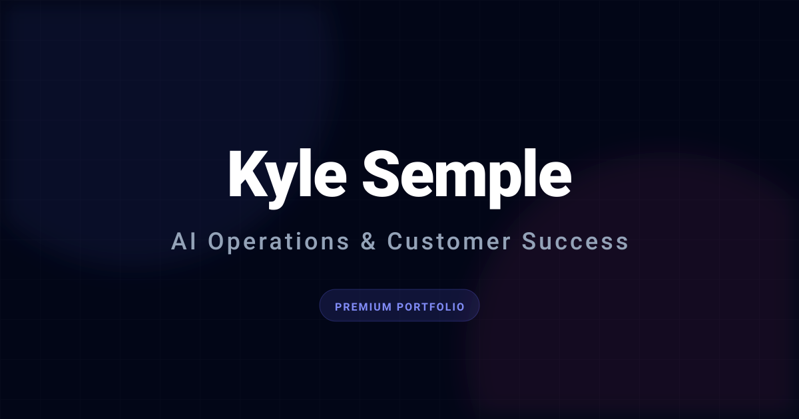

<div align="center">
  

# Kyle Semple — Professional Portfolio

**Forward Deployed Engineer · Technical Systems Translator** · Washtenaw County, MI

[Live Portfolio](https://kyle-semple-ai-solutions-portfolio-341805100474.us-east1.run.app) · [HPS Case Study](https://kyle-semple-ai-solutions-portfolio-341805100474.us-east1.run.app/projects/hps-geospatial) · [HPS Technical Deep Dive](https://kyle-semple-ai-solutions-portfolio-341805100474.us-east1.run.app/deep-dives?tab=hps-geospatial) · [Résumé](https://kyle-semple-ai-solutions-portfolio-341805100474.us-east1.run.app/resume)

[](https://github.com/slyberia/Portfolio2.0/actions/workflows/ci.yml)


</div>

## What this portfolio demonstrates

I help teams turn complex technical, operational, and spatial problems into systems people can understand, adopt, and use.

The portfolio presents one body of work through several relevant lenses: forward-deployed engineering, implementation, spatial systems, and governed AI-assisted delivery. It emphasizes:

- translating ambiguous requirements into working cross-system workflows;
- building and validating geospatial data products;
- making system states, provenance, limitations, and failure handling visible;
- pairing implementation evidence with explicit boundaries on what was not verified; and
- communicating the same work at recruiter, hiring-manager, and technical depth.

## Flagship system: HPS Geospatial Platform

[HPS Geospatial](https://hydro-frontend-786228485832.us-central1.run.app/) evolved from a mapping application into a geospatial production and validation system. The portfolio case study connects country-aware river-name artifacts, a Studio-to-Georeferencer handoff, provenance checks, Recovery, GeoTIFF output, reliability work, and a formal coverage closeout.

### Retained implementation evidence

| Workstream                       | Evidence                                                                                                                                                                       | Boundary                                                                                  |
| -------------------------------- | ------------------------------------------------------------------------------------------------------------------------------------------------------------------------------ | ----------------------------------------------------------------------------------------- |
| Regression and reliability work  | 17 pre-existing browser regressions resolved; 98 browser tests passed with 2 skipped; 228 backend tests passed with 3 skipped; TypeScript, ESLint, and production build passed | Results describe the retained validation run, not perpetual production health             |
| Country-aware river artifacts    | Belize evaluation produced 178 matched and 5 ambiguous reaches; 7 of 8 target systems passed; Guyana compatibility was preserved                                               | Belize remained intentionally partial; Rio Hondo was unverified                           |
| Studio-to-Georeferencer workflow | 33/33 browser matrix and 266 backend tests passed with 3 skipped; local PNG → handoff → provenance → Recovery → GeoTIFF flow completed                                         | Local/synthetic integration evidence does not establish live production-database behavior |
| Georeferencing closeout          | 26 registered entries: 5 verified, 10 partial, 10 unavailable, and 1 retained legacy Guyana result; 22 packaged artifacts and 4 documented withheld entries                    | Statuses are preserved rather than collapsed into a complete-coverage claim               |
| Guyana Recovery benchmark        | 9/9 supported transforms accepted; unsupported perspective rejected; accepted-case p95 error was approximately 0.742 uploaded-image pixels                                     | No wrong-source case was present in the retained report                                   |

R interoperability, complete PMTiles support, comparable Belize/Jamaica numeric benchmarks, and full production validation remain incomplete or outside the retained evidence set.

## Project inventory

The public portfolio consolidates related work into nine entries rather than presenting every milestone as a separate project.

| Project                                                                                                                                            | Portfolio role                                                       | Evidence type                                  |
| -------------------------------------------------------------------------------------------------------------------------------------------------- | -------------------------------------------------------------------- | ---------------------------------------------- |
| [HPS Geospatial Platform](https://kyle-semple-ai-solutions-portfolio-341805100474.us-east1.run.app/projects/hps-geospatial)                        | Flagship geospatial production and validation system                 | Implemented system · local workflow validation |
| [Guynode Spatial Data Hub](https://kyle-semple-ai-solutions-portfolio-341805100474.us-east1.run.app/projects/guynode)                              | Governed spatial data discovery and preview                          | System prototype                               |
| [Digital Twin AI Agent](https://kyle-semple-ai-solutions-portfolio-341805100474.us-east1.run.app/projects/digital-twin)                            | Grounded portfolio assistant with failure handling and human handoff | Implemented system                             |
| [Ops Triage](https://kyle-semple-ai-solutions-portfolio-341805100474.us-east1.run.app/projects/ops-triage)                                         | Queue controls, escalation logic, and auditability                   | Workflow                                       |
| [Automation & Operational Protocols](https://kyle-semple-ai-solutions-portfolio-341805100474.us-east1.run.app/projects/project-aegis)              | Governed AI automation architecture                                  | Working prototype                              |
| [Portfolio 2.0 — Governed AI Build Pipeline](https://kyle-semple-ai-solutions-portfolio-341805100474.us-east1.run.app/projects/portfolio-pipeline) | Scoped delivery, checks, attribution, and post-launch maintenance    | System and process                             |
| [Luxe Lofts](https://kyle-semple-ai-solutions-portfolio-341805100474.us-east1.run.app/projects/luxe-lofts)                                         | Requirements translation into a phased delivery plan                 | Workflow prototype                             |
| [Northern Grind](https://kyle-semple-ai-solutions-portfolio-341805100474.us-east1.run.app/projects/northern-grind)                                 | Small-business brand, menu, and operating-system design              | Implementation-ready case study                |
| [Public Health GIS Workflow Support](https://kyle-semple-ai-solutions-portfolio-341805100474.us-east1.run.app/projects/moh)                        | Public-sector GIS workflow and tool-fit guidance                     | Implementation support                         |

## Portfolio architecture

The site uses progressive disclosure rather than forcing every visitor through the same level of detail:

1. Project cards provide a fast, plain-language scan.
2. Case studies explain the problem, ownership, system, decisions, evidence, and limitations.
3. Optional deep dives expose architecture, data flow, state models, validation, and known gaps.

Crawler snapshots, Markdown mirrors, `llms.txt`, structured metadata, and the Digital Twin knowledge source extend the same positioning and evidence boundaries to machine-readable surfaces.

## Repository evolution

Historical branches are intentional snapshots documenting the portfolio's design, validation, and implementation maturity over time (which is why historical branches remain fixed rather than being updated to match `main`). The `main` branch represents the current portfolio; retained branches provide evidence of its evolution.

## Technology

| Layer         | Technology                                                          |
| ------------- | ------------------------------------------------------------------- |
| Frontend      | React 18, TypeScript strict, Vite 8, Tailwind CSS v3                |
| Routing       | React Router v7                                                     |
| Server and AI | Express; Gemini through a server-side proxy                         |
| Deployment    | Docker and Google Cloud Run                                         |
| Validation    | Vitest, Testing Library, Playwright visual review, ESLint, Prettier |
| Delivery      | GitHub Actions, crawler validation, dependency and security checks  |

The chatbot distinguishes rate limits, rejected origins, missing configuration, oversized input, and backend outages. Automated prompt and routing tests validate application behavior; they do not prove the quality of every live model response.

## Engineering documentation

| Document                                  | Purpose                                                                             |
| ----------------------------------------- | ----------------------------------------------------------------------------------- |
| [How It Was Built](HOW_IT_WAS_BUILT.md)   | Build narrative, prototype-to-deployment corrections, and human/AI responsibilities |
| [Architecture Decisions](DECISIONS.md)    | Decisions, rejected alternatives, and accepted tradeoffs                            |
| [Architecture Overview](ARCHITECTURE.md)  | Application structure, request flow, and deployment model                           |
| [AI Attribution](AI_ATTRIBUTION.md)       | AI-use ledger, human review boundaries, and provenance gaps                         |
| [Threat Model](THREAT_MODEL.md)           | Threats, mitigations, accepted risks, and deferred hardening                        |
| [Security Policy](SECURITY.md)            | Supported versions and vulnerability reporting                                      |
| [Security Audit](SECURITY_AUDIT.md)       | Historical audit findings and resolution trail                                      |
| [Machine-readable index](public/llms.txt) | Canonical crawler and LLM discovery routes                                          |

## Run locally

### Prerequisites

- Node.js 20 (see `.nvmrc`)
- npm

```bash
git clone https://github.com/slyberia/Portfolio2.0.git
cd Portfolio2.0
nvm use
cp .env.example .env.local
npm install
npm run dev
```

`VITE_GEMINI_ENABLED=true` requires the Express server. Run `npm run dev:full` to start both Vite and Express.

## Validation

The repository’s normal batch-boundary checks are:

```bash
npm run typecheck
npm run lint
npm run format:check
npm test -- --run
npm run build
```

For changes affecting routes, content, SEO, or crawler surfaces, also run:

```bash
npm run generate:crawler-html
npm run validate:crawler
```

## Useful scripts

| Script                          | Purpose                                                       |
| ------------------------------- | ------------------------------------------------------------- |
| `npm run dev`                   | Start the Vite development server                             |
| `npm run dev:full`              | Start the frontend and Express server together                |
| `npm run serve`                 | Start Express on port 8080                                    |
| `npm run test -- --run`         | Run the Vitest suite once                                     |
| `npm run build`                 | Type-check and create the production bundle                   |
| `npm run generate:crawler-html` | Generate static crawler snapshots                             |
| `npm run validate:crawler`      | Check route, sitemap, metadata, and machine-readable coverage |
| `npm run generate:resume-pdf`   | Build and export the portfolio résumé PDF                     |

## Evidence policy

Portfolio claims follow an **outcome → evidence → limitation** pattern. Local or synthetic validation is labeled as such; implementation, validation, and confirmed production deployment are not treated as interchangeable. Metrics, customers, and outcomes are not inferred when the retained source material does not establish them.

## License

[MIT](LICENSE)
