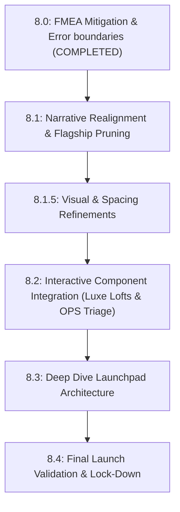

# Phase 8 — Master Execution Packet: Lean Launchpad & Flagship Realignment

## Shared Operating Rules

1. **Atomic Execution**: Do not execute all subphases at once. Execute only the active subphase specified by the Architect. Use the rest of this document as context, constraints, and sequencing guidance.
2. **Git Preflight**: Before any implementation subphase, verify branch synchronicity with `archive/phase-3-baseline` (or current active branch) and ensure a clean working tree.
3. **Artifact Archival**: Every subphase must result in an archived prompt and report in `docs/workflow/prompts/` and `docs/workflow/reports/` respectively.
4. **Governance First**: All technical changes must be accompanied by governance validation (review, audit, ledger update).
5. **No Blind Merges**: All mutations must be reviewed by the Architect.
6. **Linting Check**: Windows CRLF line endings can break Prettier lint checks. Always run `npm run fix:format` (or `npx prettier --write .`) prior to executing validation checks with `npm run validate:phase`.

---

## Phase 8 Subphase Map & Sequence (Track B: Lean Launchpad)

---

## Phase 8 Goals

- **Accelerated Job-Market Readiness**: Execute a highly targeted "Lean Launchpad" strategy to ship the portfolio within 24-48 hours. Focus strictly on integrating finished, high-fidelity assets.
- **Flagship Curation (Pruning)**: Instantly elevate the perceived seniority of the portfolio by surgically hiding lighter/weaker project entries (NBA 2K, Project Aegis, Prompter Hub).
- **Operations & Systems Re-framing**: Realign the OPS Triage narrative to focus strictly on operations, queues, and SLA telemetry (decoupling it from GIS).
- **Deep-Dive Separation**: Transition the existing Deep Dive page into a strategic launchpad, cleanly separating tactical engineering proof (Projects) from strategic business and marketing plans (Deep Dives).

---

## Subphase 8.0 — FMEA Mitigation: Parse Error Handlers (COMPLETED)

_Status: Completed & Merged._

---

## Subphase 8.1 — Narrative Realignment & Flagship Pruning

### Objective

Cleanse the project metadata to leave only elite flagship entries visible, and upgrade the written copy for Luxe Lofts and OPS Triage.

### Allowed Scope

- Edit `src/constants.tsx` and `src/data/projectMetadata.ts` to hide/remove `nba-systems-qa`, `project-aegis`, and `prompter-hub` from public navigation and registries.
- Update `src/data/caseStudyData.ts`:
  - Integrate the new operational/telemetry-focused copy for **OPS Triage**.
  - Extract and integrate the new comprehensive written work for **Luxe Lofts** (to be cloned from the external mockup repository).

### Required Outputs

- Clean UI showing only the highest-quality flagship projects.
- Updated case study copy.

---

## Subphase 8.1.5 — Visual & Spacing Refinements

### Objective

Execute a comprehensive visual audit and code sweep to integrate the shortlist of visual refinements.

### Allowed Scope

1. **Whitespace Reduction**: Tighten margins, block sections, and excessive line paddings.
2. **Project Library Color Mismatch**: Fix color schemes on the home page's project grid to strictly match curated HSL palettes (e.g., `tide`, `gild`).
3. **Hero Section Margins**: Recalculate margins and absolute bounds in the homepage Hero section.
4. **Bolder Job Tracks**: Redesign role tracks with higher contrast and striking badges.
5. **Footer Links**: Add the primary GitHub link to the link cluster in the footer.
6. **Ann Arbor Spatial Badge**: Populate the "Based in Ann Arbor" section of the footer with a sophisticated spatial/coordinate geode badge.
7. **Flagship Sheen**: Add premium CSS sheen animations and glowing hover transitions on primary action cards.
8. **Education & Certs**: Format IBM/Google certificates and academic credentials into a structured grid.

---

## Subphase 8.2 — Interactive Component Integration

### Objective

Embed the completed, high-fidelity interactive visual widgets into their respective project entries.

### Allowed Scope

- **Luxe Lofts**:
  - Clone the external Luxe Lofts mockup repository into a temporary scratch folder (`scratch/`).
  - Extract necessary interactive components, UI layouts, and styles.
  - Embed the interactive mockup/components directly into the local portfolio application.
- **OPS Triage**:
  - Integrate the completed interactive telemetry dashboard (Triage Policy Slider, live queue simulation, Recharts integration) into the OPS Triage project view.

---

## Subphase 8.3 — Deep Dive Launchpad Architecture

### Objective

Refactor the existing monolithic `/portfolio2/deep-dive` page into a dynamic, tabbed launchpad that houses distinct strategic deep dives.

### Allowed Scope

- Update `src/views/DeepDiveView.tsx` (and `src/router.tsx` if dynamic routing is necessary) to support multiple distinct deep-dive topics.
- **Portfolio 2.0 Process**: Retain the existing build timeline, toolchain, and evidence ledger as one major deep-dive section.
- **Luxe Lofts Strategy**: Add the new "Digital Restructuring & Marketing Strategy" business plan as a featured deep-dive tab/section.
- Implement cross-linking CTA buttons between the Project Detail views and their corresponding Strategic Deep Dives.

---

## Subphase 8.4 — Final Launch Validation

### Objective

Run final formatting sweeps, build scripts, execute crawler HTML generations, and test suites to freeze the project for production deployment.

### Required Outputs

- `npm run fix:format` run to resolve any Windows CRLF issues.
- `npm run validate:phase` runs successfully (0 errors across tests, linting, typecheck, and crawler generation).
- A clean git tree with a production launch report saved in `docs/workflow/reports/phase-8-final-launch-report.md`.
