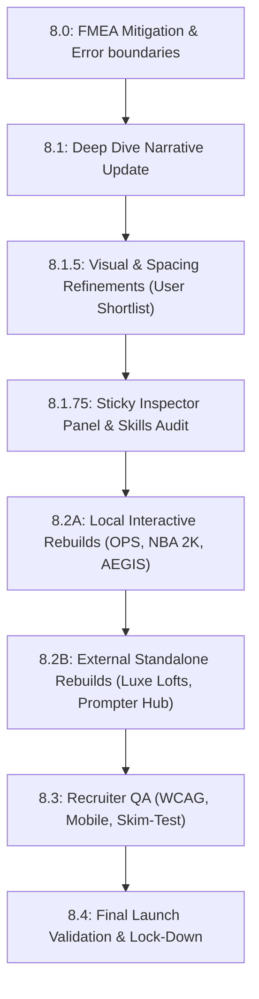

# Phase 8 — Master Execution Packet: Visual, Layout, and Interactive Project Overhauls

## Shared Operating Rules

1. **Atomic Execution**: Do not execute all subphases at once. Execute only the active subphase specified by the Architect. Use the rest of this document as context, constraints, and sequencing guidance.
2. **Git Preflight**: Before any implementation subphase, verify branch synchronicity with `archive/phase-3-baseline` and ensure a clean working tree.
3. **Artifact Archival**: Every subphase must result in an archived prompt and report in `docs/workflow/prompts/` and `docs/workflow/reports/` respectively.
4. **Governance First**: All technical changes must be accompanied by governance validation (review, audit, ledger update).
5. **No Blind Merges**: All mutations must be reviewed by the Architect or a designated reviewer (e.g., Jules).
6. **Linting Check**: Windows CRLF line endings can break Prettier lint checks. Always run `npx prettier --write .` prior to executing validation checks with `npm run validate:phase`.

---

## Phase 8 Subphase Map & Sequence

---

## Phase 8 Goals

- **Harden Client Stability**: Inject robust React `ErrorBoundary` guards to insulate the portfolio's markdown parser from layout-breaking render faults.
- **Narrative Precision**: Align terminology with "Customer Success Manager (CSM)" and weave Multi-LLM appellate governance and FMEA safeguards into the process logs.
- **Visual Excellence (Wow Factor)**: Resolve excessive padding, hero margin misalignments, and generic colors. Upgrade the footer with coordinates and social anchors, add flagship sheen animations, and polish the education/certifications layout.
- **High-Impact Navigation**: Establish a sticky scroll-tracking **Inspector Panel** on the left viewport margin, packed with quick filters, searches, and clickable visual proof anchors.
- **Accessible, Stateful Rebuilds (Option C)**:
  - **In-Portfolio**: Transform the **OPS Triage Dashboard** (live incident telemetry, dual-mode system dynamic slider, Recharts metrics), **NBA 2K Stats Harness** (controlled probability analyzer), and **AEGIS Protocol** (live monospaced reasoning console) into beautiful React components.
  - **External Deployments**: Upgrade **Luxe Lofts** (interactive booking, dynamic rate engine) and **Prompter Hub** (functional prompt sandboxing, recursive Gemini schema builder) to premium standalone applications hosted externally.

---

## Subphase 8.0 — FMEA Mitigation: Parse Error Handlers

### Objective
Wrap markdown parser entry points (like `MarkdownSection`) in a custom React `ErrorBoundary` to gracefully degrade if a malformed markdown string or syntax breach occurs.

### Allowed Scope
- Creation of `src/components/ErrorBoundary.tsx` incorporating a fallback UI (e.g., slate card with a friendly "View Raw Raw Text" toggle or error isolation banner).
- Wrapping `MarkdownSection` inside `ProjectDetailView` and `DeepDiveView` with the error boundary.

### Required Outputs
- `ErrorBoundary.tsx` deployed.
- Unit testing or verification logs confirming that manual throws within markdown nodes are caught without taking down the core app.
- `npm run validate:phase` runs cleanly.

---

## Subphase 8.1 — Process / Deep Dive Narrative Update

### Objective
Update case studies and process pages to reflect the high-grade Multi-LLM Governance pipeline, FMEA mitigation, and automated recruiter static paths created in prior phases. Standardize all role references to highlight "Customer Success" and "CSM Integration" alignment.

### Allowed Scope
- Editing files in `src/data/caseStudyData.ts` to enrich the governance sections.
- Modifying `src/constants.tsx` and related landing view narratives to showcase professional client onboarding and handoff assets.

### Required Outputs
- Fully polished copy outlining Multi-LLM appellate pipelines (Jules, Codex, appellate checking).
- Static crawler build verification.

---

## Subphase 8.1.5 — Visual & Spacing Refinements (User Shortlist)

### Objective
Execute a comprehensive visual audit and code sweep to integrate your shortlist of visual refinements:
1. **Whitespace Reduction**: Tighten margins, block sections, and excessive line paddings.
2. **Project Library Color Mismatch**: Fix color schemes on the home page's project grid to strictly match our curated, premium HSL palettes instead of standard default colors.
3. **Hero Section Margins**: Recalculate margins and absolute bounds in the homepage Hero section to eliminate awkward top/bottom offset imbalances.
4. **Bolder Job Tracks**: Redesign and color-code the role tracks (e.g., AI Workflow, CSE/Implementation, Ops Analytics) with higher contrast, bolder, and more visually striking badges to pop at first glance.
5. **Footer Links**: Add the primary GitHub link to the link cluster in the footer.
6. **Ann Arbor Spatial Badge**: Populate the "Based in Ann Arbor" section of the footer with a sophisticated spatial/coordinate element or geode badge.
7. **Flagship Sheen**: Add premium CSS sheen animations and glowing hover transitions on primary action cards.
8. **Education & Certs**: Format and style the IBM/Google certificates and academic credentials into a structured, eye-catching grid.

### Allowed Scope
- Updates to `src/index.css`, layout wrappers, footer, hero, and main grid components.
- Adding custom CSS animations and variables in the design system.

---

## Subphase 8.1.75 — Sticky Scrolling Inspector Panel & Interactive Audit

### Objective
Build the **Inspector Panel** on the left viewport margin. It must stay in view dynamically as the user scrolls, avoiding the need to scroll back up. It will feature:
- A search and filter input for scanning skill categories.
- Toggles to filter the current page content by track/lane (AI Systems, QA, GIS, Implementation).
- Smooth scroll-to-element or direct click navigation pointing to specific "Visual Evidence Blocks" or project links.

### Allowed Scope
- Creating `src/components/InspectorPanel.tsx` and styling it with glassmorphism, glowing state variables, and smooth collapse transitions for mobile viewports.
- Integrating it into the core project and index layout columns.

---

## Subphase 8.2A — Interactive Rebuilds: In-Portfolio React Components

### Objective
Rebuild three key body-of-work projects into highly polished, fully functional local React components styled with premium dark-mode telemetry aesthetics:
1. **OPS Triage Dashboard**:
   - Replace the static placeholder grid with a live-ticking Incident Queue showing incoming anomalies (e.g., GIS gaps, Zendesk sync lag).
   - Implement a **"Triage Policy Slider"** mapping system dynamics:
     - *Max-Throughput*: High processing velocity, but error rates and topological gaps spike, causing red alert flashes.
     - *Zero-Defect*: 100% data QA precision, but slow speed causes the unprocessed backlog to swell and breach SLA timings.
   - Embed real-time analytics graphs using **Recharts** showing SLA velocity, defect rate, and first-pass yield under both policy models.
2. **NBA 2K Stats Harness**:
   - Create an interactive probability playground. Let recruiters run trial simulations (N = 100 to N = 1000) to see how statistical variables stabilize under controlled baselines, demonstrating data modeling and quality control.
3. **AEGIS Protocol Walkthrough Console**:
   - Build a monospaced terminal logs visualizer simulating the AI Principal Architect check-loop.
   - Let users click on logs to inspect the raw XML governance prompts, reasoning logs, and check results (with glowing status markers).

### Allowed Scope
- Rebuilding components within `src/components/` and embedding them directly into their respective project detail templates.
- Importing and configuring `recharts` or standard visual data tools.

---

## Subphase 8.2B — Interactive Rebuilds: External Stateful Deployments

### Objective
Upgrade two flagship applications to premium, fully responsive, and highly interactive standalone websites hosted on external URLs (Vercel/Netlify) and link out to them:
1. **Luxe Lofts Operational Platform**:
   - A stunning real-estate/hospitality platform containing a functional booking orchestrator, real-time rate quotes calculation (varying by guest capacity and hours), and an AI Corporate Event Planner interface.
2. **Prompter Hub V9 Pro Sandbox**:
   - A fully functional developer sandbox featuring a recursive Gemini JSON responseSchema compiler and prompt generator engine utilizing LocalStorage persistence.

### Allowed Scope
- Updating links in the portfolio case study registry to target the live external links.
- Reviewing external project codebases for production excellence prior to linking.

---

## Subphase 8.3 — Recruiter Quality Assurance

### Objective
Audit all pages and static crawl routes (`/apply/implementation`, `/apply/ops-analytics`, `/apply/gis`) to guarantee:
- **Mobile responsiveness**: High usability down to 320px screens.
- **Accessibility**: Meeting WCAG AA standards (high contrast colors, proper focus rings, clear semantic ARIA landmarks).
- **Skim-Testing**: Highly readable heading structures, clear action buttons, and highlighted proof blocks to ensure recruiters can capture value in under 30 seconds.

### Required Outputs
- Accessibility reports and mobile snapshot checks.
- Zero layout overflow issues.

---

## Subphase 8.4 — Final Launch Validation

### Objective
Run final build scripts, execute crawler HTML generations, and run full test suites to freeze the project for production deployment.

### Required Outputs
- All tests passing (`npm run validate:phase` runs 80/80 tests successfully).
- A clean git tree with zero linting warnings.
- Production launch report saved in `docs/workflow/reports/phase-8-final-launch-report.md`.
